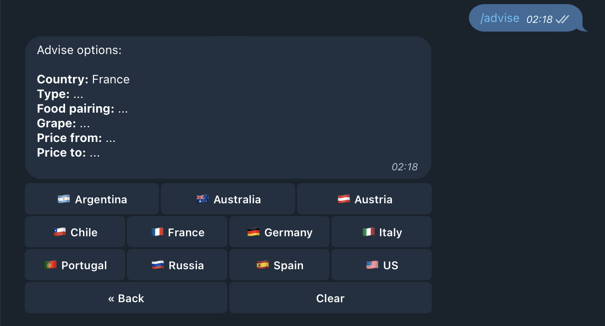
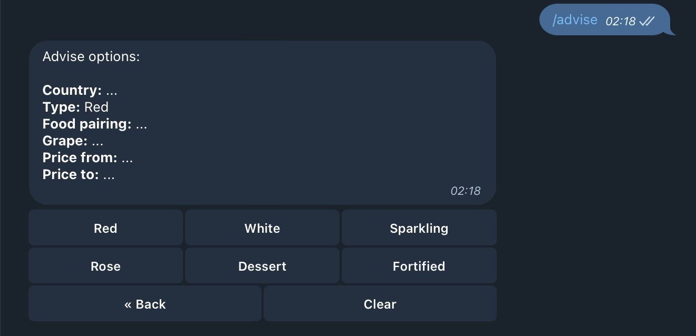
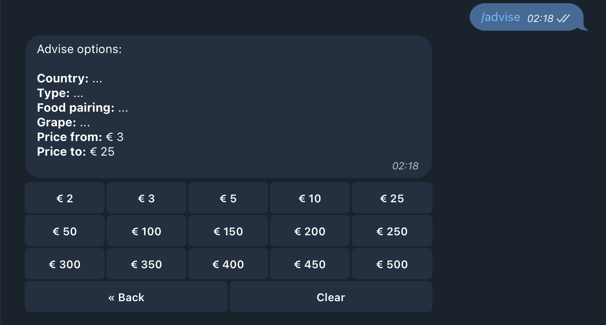
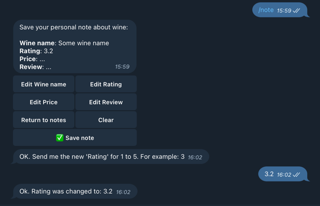

# Cavisto
[](https://github.com/romutchio/Cavisto/actions/workflows/scala.yml)
[](https://codecov.io/gh/romutchio/Cavisto)  
Telegram bot for saving and advising wine

### Plan:
1. Extract data about vines
   - For example, vivino.com is a good data source, but it requires data parsing for search.
     For example, search request for wine Baron d'Arignac.
     ```bash
     > curl https://www.vivino.com/search/wines\?q\=baron%20d

     <span class='header-smaller text-block wine-card__name'>
     <a class="link-color-alt-grey" data-cartitemsource="text-search" href="/wines/1474107"><span class='bold'>
     <mark>Baron</mark> <mark>d</mark>'Arignac Vin Rouge
     </span>
     ```
   - Get data about countries
     ```bash
     > curl https://www.vivino.com/api/countries
     ```
   - Get wine suggestions, for example wines of France with min rating and price range. Just what I want.
     ```bash
     > curl 'https://www.vivino.com/api/explore/explore?country_code=FR&currency_code=EUR&min_rating=3&price_range_mix=7&price_range_max=20&order_by=price&order=asc'
     "https://www.vivino.com/api/explore/explore",
     params = {
         "country_code": "FR",
         "country_codes[]":"pt",
         "currency_code":"EUR",
         "grape_filter":"varietal",
         "min_rating":"1",
         "order_by":"price",
         "order":"asc",
         "page": 1,
         "price_range_max":"500",
         "price_range_min":"0",
         "wine_type_ids[]":"1"
     },
     ```
2. Setup database and write controllers for CRUD operations   

3. Add telegram bot interaction
   - Save user info to Postgres db
   - Save user wines (formalize name using vivino api), support photo uploading
   - Add '/advise' command with parameters, suggest user preferences based on saved vines
   - Add '/top' command to get most popular wines among users (Optional)
   - Add '/note' command for writing user's personal note about wine
   - Add '/search' command to search wines by name
   - Add '/notes' command to get all user's notes


### TODO:
- [x] Init project
- [x] Write code for parsing vivino.com
- [x] Setup database with docker-compose and connect to it
- [x] Write functions for db usage
- [x] Integrate with telegram
  - [x] Implement '/advise' command
  - [x] Implement '/note' command
  - [x] Implement '/search' command
  - [x] Implement '/notes' command 


### Commands' showcase:
- `/start`
  

- `/help`
    

- `/advise`
  
  - `Country` button
  
  - `Type` button
  
  - `Price` buttons
  
  - `Advise` button
  
  - `Next` button
  

- `/note`
  
  - `Edit wine name` button
  
  - `Edit Rating` button
  
  - `Edit Review` button
  
  - `Save` button
  

- `/notes`  
  - User's list of notes is empty
  
  - User's list of notes is not empty (max 10 on page)
  
  
  - `10` button click (You can edit note)
  

- `/search cabernet`
  